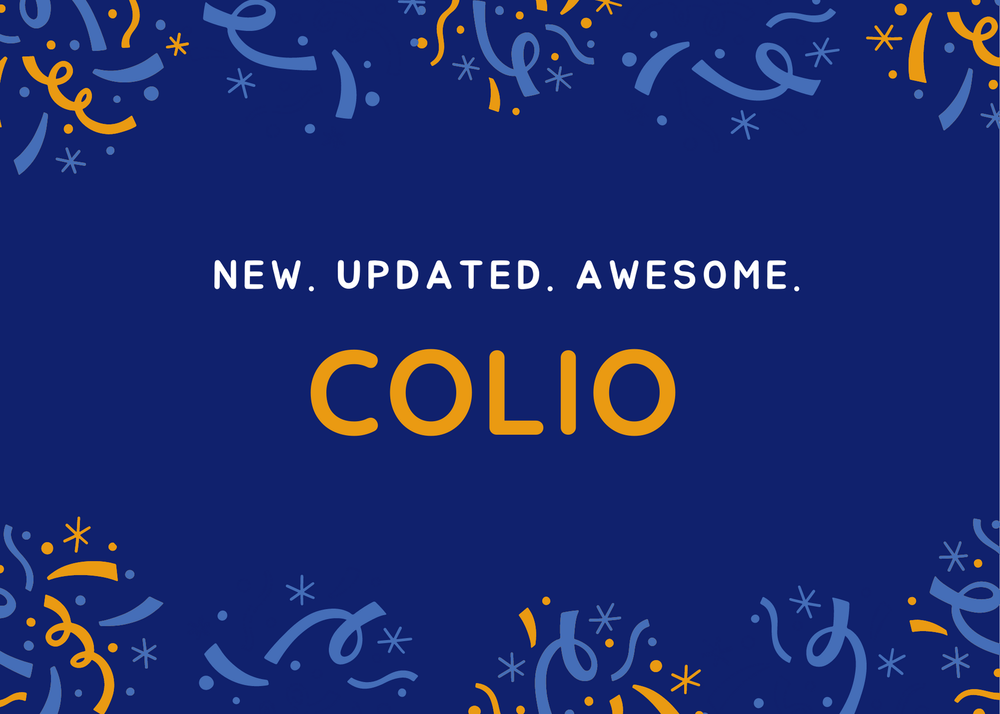

<h1>Description</h1>
<h2>Story</h4>

This was a previously a very dusty, old website, but with the help of my new knowledge, I started to clean the dust and make it into a shiny, new website.

 
<h2>Info</h2>

I have got the important text popup better, with text shadow and eye-catching colors. The images are responsive so, they don't make everything clogged up, like how it happend for me for the last few times... I have also used bootstrap for some cases, such as cards, badges and more! For the last, I have got a cool, color changing background for the footer with transitions from yellow to green to blue to pink and finally to peach.

 
<h2>Colors</h2>
<ul>
    <li>Entire Website</li>
        <ul>
            <li>Header 2 - #00BDAA</li>
            <li>Text - #1A374D</li>
            <li>Horizontal Rule - #FECD1A</li>
            <li>Sub Headings - #FF7567</li>
        </ul>
    <li>Intro</li>
        <ul>
            <li>Nav Links - #00BDAA</li>
            <li>Nav Links Hover - #FF7567</li>
            <li>Name - #FD3A69</li>
            <li>Job - #00BDAA</li>
        </ul>
    <li>Projects</li>
        <ul>
            <li>Card Background - #DBEDF3</li>
            <li>Card Title - #516BEB</li>
        </ul>
    <li>Footer</li>
        <ul>
            <li>First - #FECD1A</li>
            <li>Second - #23D5AB</li>
            <li>Third - #23A6D5</li>
            <li>Fourth - #E73C7E</li>
            <li>Fifth - #EE7752</li>
        </ul>
</ul>
 
<h2>Credits</h2>
<ul>
    <li><a href="https://www.getbootstrap.com/">Bootstrap</a></li>
    <li><a href="https://www.flaticon.com/uicons">Flaticon Uicons</a></li>
    <li><a href="https://fonts.google.com/">Google Fonts</a></li>
</ul>
